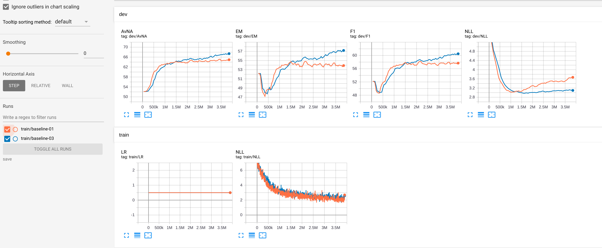

## Abstract
This is final project of stanford CS224n. I record my work based on the code scaffolding.  
Environment:
    RTX3090 * 2
    128G RAM
## my work record
- [x] analyze paper BiDaf and char_embedding paper https://arxiv.org/abs/1408.5882
- [x] add Character Embedding Layer in original BiDaf paper
- [x] train baseline
- [x] train model with Character Embedding layer (using around 10G video memory)
- [ ] choose a paper related to QA task using Squad dataset

## Result

### Explanation
- train/baseline-01 is the given baseline
    > 1. EM: 54.81
    > 2. F1: 58.20
- train/baseline-02 is the model with my implementation of Character Embedding
    > 1. EM: 57.20
    > 2. F1: 60.51

After adding the CM layer, it performs better with 3.9 improvement in EM and 3.3 improvement in F1 score. But both are far behind the result of BiDaf EM: 73.744 F1: 81.525. I think there are several reasons causing that.
1. the final project code is just a simple version of BiDaf. It covers all aspects of BiDaf but with a smaller model size. So the model is not flexible as BiDaf. Project given code is actually a learning code of the BiDaf.
2. Hyperparameter settings. Due to the limitation of the hardware, my model is a lite version.
3. My implementation is not absolutely the same as BiDaf. 
### my work

CM layer: According to BiDaf original paper, it implement CM following paper `CNNforSC`(https://arxiv.org/abs/1408.5882). And to merge this layer to the course scaffolding code, I made necessary adjustment.  
1. To avoid refactoring to much code, I modify the hidden size of the word embedding layer to be half of the origin's so that after concatenating to the Character Embedding layer with the same one half hidden size, the subsequent code can maintain.
2. My implementation of CM layer is a little different from the BiDaf's CM layer, but both have the same idea following `CNNforSC`. Details: I use tanh() which is suggested in CNNforSC instead of relu() in BiDaf. And for window size, I use [2, 3, 4, 5] and each with 100 filters(the same as BiDaf).
3. Related hyperparameters settings are different, I use default settings of the final project. 

### TODO
a paper. I may choose transformer related.  
- [  ] adding masks to query encoder   
My idea:  
> there are papers using mask when encoding context and query. I guess may be we can only encode query with a randomness. It is based on a assumption that there already exsits explicit answer but our questions may be ambiguous. This usually make it difficult for search engine to retrieve the answer we want.
